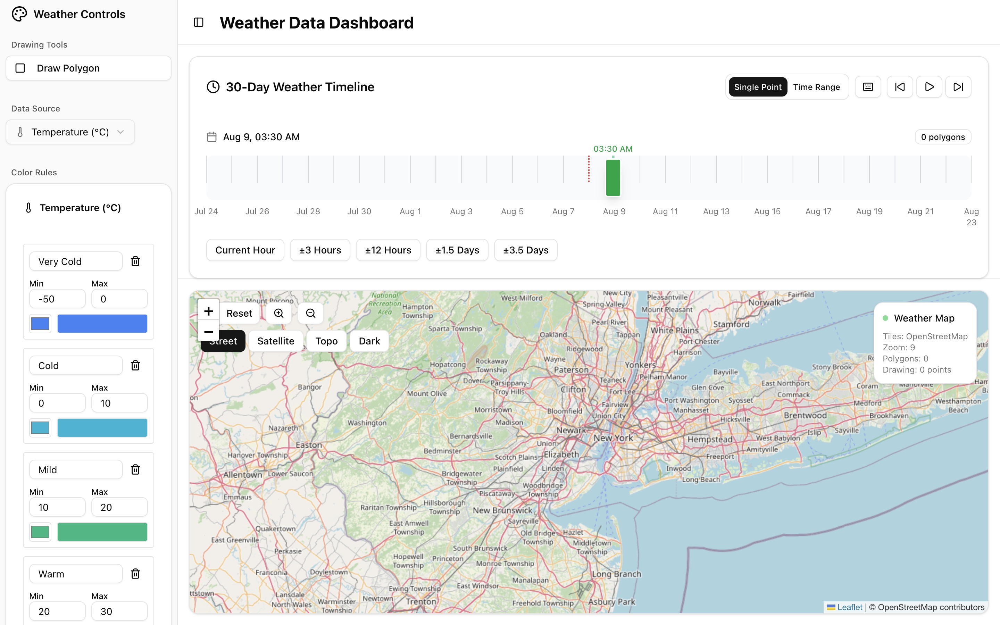
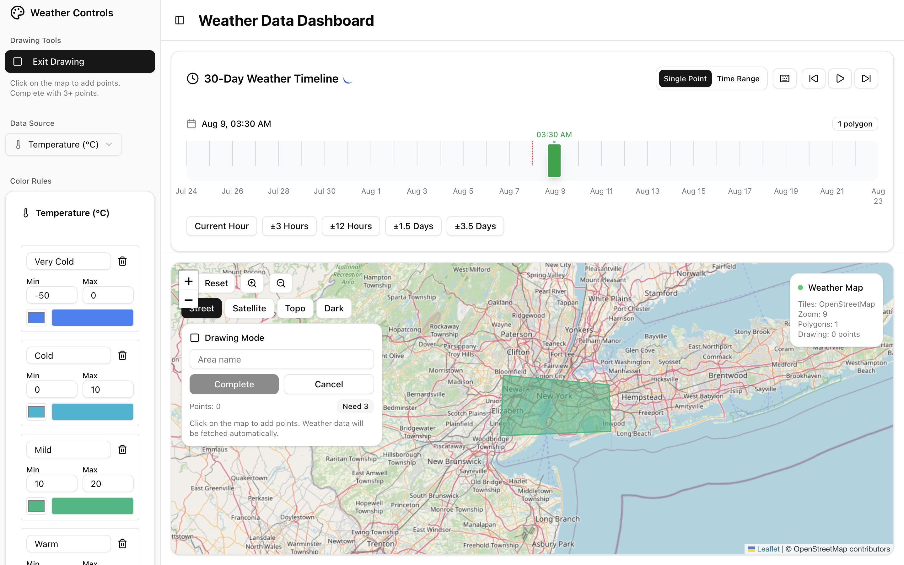

# Weather Dashboard

An interactive weather visualization dashboard that allows users to draw polygons on a map and visualize real-time weather data with customizable color coding rules and timeline controls.

🌐 **Live Demo**: [https://weather-dashboard-jade-chi.vercel.app/](https://weather-dashboard-jade-chi.vercel.app/)

## Screenshots


_Complete weather dashboard interface showing the interactive map, sidebar controls, and weather timeline with real-time data visualization_


_Custom polygon creation on the map for defining weather monitoring areas with color-coded weather data visualization_

## Features

- **Interactive Map Visualization**: Built with Leaflet for smooth map interactions
- **Polygon Drawing**: Draw custom polygons on the map to define weather monitoring areas
- **Real-time Weather Data**: Fetches weather data from Open-Meteo API for temperature, humidity, wind speed, and precipitation
- **Customizable Color Rules**: Define color coding rules based on weather data thresholds
- **Weather Timeline**: Interactive timeline with play/pause functionality for temporal weather data exploration
- **Responsive Design**: Optimized for both desktop and mobile devices
- **Data Persistence**: Local storage to save polygons, color rules, and timeline settings

## Setup and Installation

### Prerequisites

- Node.js 18+
- npm, yarn, pnpm, or bun

### Installation Steps

1. **Clone the repository**

   ```bash
   git clone https://github.com/FarhanAliMirza/weather-dashboard.git
   cd weather-dashboard
   ```

2. **Install dependencies**

   ```bash
   npm install
   # or
   yarn install
   # or
   pnpm install
   ```

3. **Run the development server**

   ```bash
   npm run dev
   # or
   yarn dev
   # or
   pnpm dev
   # or
   bun dev
   ```

4. **Open your browser**
   Navigate to [http://localhost:3000](http://localhost:3000) to see the application.

### Build for Production

```bash
npm run build
npm run start
```

## Libraries and Technologies Used

### Core Framework

- **Next.js 15.2.4** - React framework with App Router
- **React 19** - UI library
- **TypeScript 5** - Type-safe JavaScript

### UI Components & Styling

- **Tailwind CSS 4** - Utility-first CSS framework
- **shadcn/ui** - Pre-built accessible React components
- **Radix UI** - Headless UI primitives for accessibility
- **Lucide React** - Icon library
- **class-variance-authority** - Type-safe component variants

### Map & Visualization

- **Leaflet 1.9.4** - Interactive maps library
- **@types/leaflet** - TypeScript definitions for Leaflet

### Data & State Management

- **Open-Meteo API** - Free weather API for real-time weather data
- **Local Storage** - Client-side data persistence

### Development Tools

- **ESLint** - Code linting
- **PostCSS** - CSS processing
- **Turbopack** - Fast build tool (Next.js dev mode)

## Project Structure

```
weather-dashboard/
├── app/                    # Next.js App Router
│   ├── page.tsx           # Main dashboard page
│   ├── layout.tsx         # Root layout
│   └── globals.css        # Global styles
├── components/            # React components
│   ├── ui/               # shadcn/ui components
│   ├── leaflet-visualization.tsx  # Map component
│   ├── weather-sidebar.tsx       # Control sidebar
│   └── weather-timeline.tsx      # Timeline component
├── lib/                   # Utility libraries
│   ├── weather-api.ts    # Weather API integration
│   ├── storage.ts        # Local storage utilities
│   └── utils.ts          # General utilities
├── hooks/                 # Custom React hooks
└── public/               # Static assets
```

## Design and Development Remarks

### Architecture Decisions

**Component Architecture**: The application follows a modular component-based architecture with clear separation of concerns:

- Main dashboard orchestrates state management and data flow
- Sidebar handles user controls and polygon management
- Map visualization manages Leaflet integration and polygon rendering
- Timeline provides temporal data navigation and weather data fetching

**State Management**: Uses React's built-in state management with `useState` and `useCallback` for performance optimization. Local storage provides persistence across sessions without requiring a backend database.

**API Integration**: Integrates with Open-Meteo API for weather data, providing a fallback to mock data to ensure the application remains functional even during API downtime.

### Technical Highlights

**SSR-Safe Map Integration**: Leaflet is dynamically imported to avoid server-side rendering issues, with proper loading states and error boundaries.

**Responsive Timeline**: The weather timeline component adapts to different screen sizes and provides keyboard shortcuts for power users.

**Type Safety**: Comprehensive TypeScript integration ensures type safety across all components and API interactions.

**Performance Optimizations**:

- Memoized callbacks and effects to prevent unnecessary re-renders
- Debounced map view updates to optimize performance during map interactions
- Efficient polygon rendering with color-coded visualizations

### User Experience Considerations

**Intuitive Controls**: Drawing mode toggle, clear visual feedback for polygon creation, and contextual tooltips guide users through the interface.

**Accessibility**: Built on Radix UI primitives ensuring keyboard navigation and screen reader compatibility.

**Mobile Experience**: Responsive design with touch-friendly controls and optimized timeline interactions for mobile devices.

### Remarks from the developer

- This project was developed with the help of ChatGPT and GitHub Copilot and was built in 48 hours.
- There are still some areas for improvement, such as improving the UI/UX, adding more features, and optimizing performance.
- The project has some limitations and may lag or even carsh while using.

## Contributing

1. Fork the repository
2. Create your feature branch (`git checkout -b feature/amazing-feature`)
3. Commit your changes (`git commit -m 'Add some amazing feature'`)
4. Push to the branch (`git push origin feature/amazing-feature`)
5. Open a Pull Request

## License

This project is licensed under the MIT License - see the LICENSE file for details.
